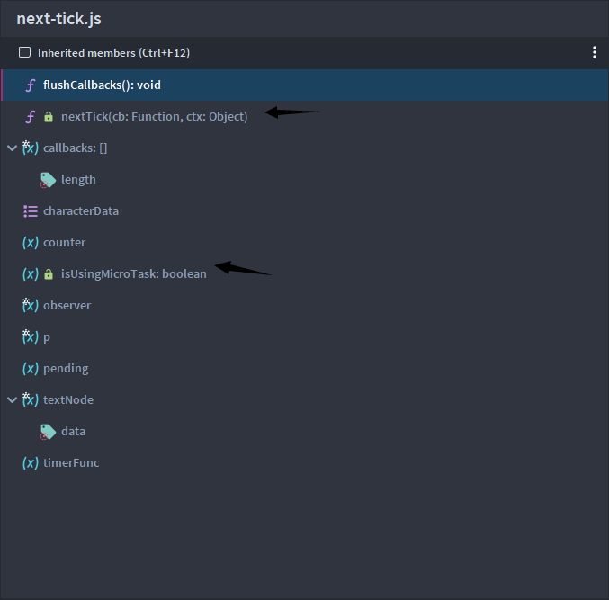
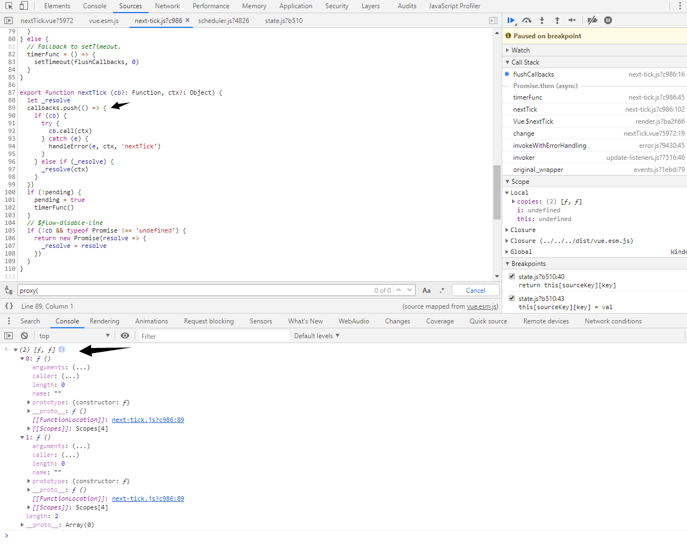
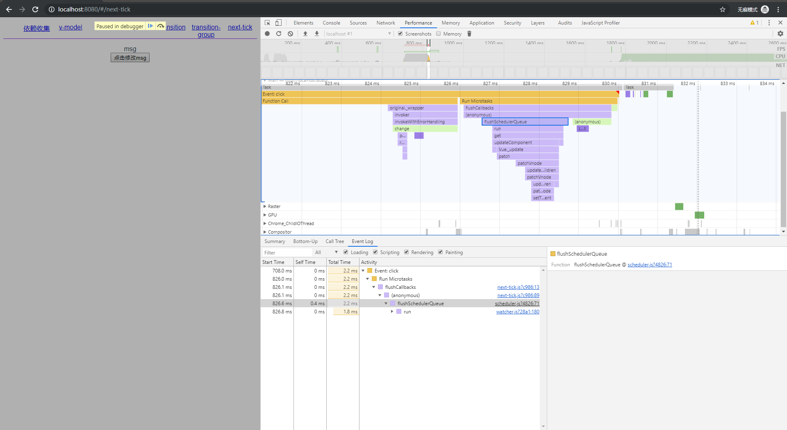
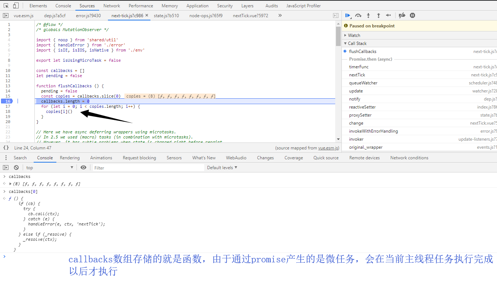

## nextTick.js

nextTick采用异步调用的方式触发回调函数，Vue 在内部对异步队列尝试使用原生的 `Promise.then`、`MutationObserver` 和 `setImmediate`，如果执行环境不支持，则会采用 `setTimeout(fn, 0)` 代替。

```
import { noop } from 'shared/util'
import { handleError } from './error'
import { isIE, isIOS, isNative } from './env'

export let isUsingMicroTask = false

const callbacks = []
let pending = false

function flushCallbacks () {
  // 执行callbacks
  pending = false
  const copies = callbacks.slice(0)
  callbacks.length = 0
  for (let i = 0; i < copies.length; i++) {
    copies[i]()
  }
}

// Here we have async deferring wrappers using microtasks.
// In 2.5 we used (macro) tasks (in combination with microtasks).
// However, it has subtle problems when state is changed right before repaint
// (e.g. #6813, out-in transitions).
// Also, using (macro) tasks in event handler would cause some weird behaviors
// that cannot be circumvented (e.g. #7109, #7153, #7546, #7834, #8109).
// So we now use microtasks everywhere, again.
// A major drawback of this tradeoff is that there are some scenarios
// where microtasks have too high a priority and fire in between supposedly
// sequential events (e.g. #4521, #6690, which have workarounds)
// or even between bubbling of the same event (#6566).
let timerFunc

// The nextTick behavior leverages the microtask queue, which can be accessed
// via either native Promise.then or MutationObserver.
// MutationObserver has wider support, however it is seriously bugged in
// UIWebView in iOS >= 9.3.3 when triggered in touch event handlers. It
// completely stops working after triggering a few times... so, if native
// Promise is available, we will use it:
/* istanbul ignore next, $flow-disable-line */
if (typeof Promise !== 'undefined' && isNative(Promise)) {
  const p = Promise.resolve()
  timerFunc = () => {
    p.then(flushCallbacks)
    // In problematic UIWebViews, Promise.then doesn't completely break, but
    // it can get stuck in a weird state where callbacks are pushed into the
    // microtask queue but the queue isn't being flushed, until the browser
    // needs to do some other work, e.g. handle a timer. Therefore we can
    // "force" the microtask queue to be flushed by adding an empty timer.
    if (isIOS) setTimeout(noop) // iosbug 通过加入一个空的宏任务 强制队列刷新
  }
  isUsingMicroTask = true
} else if (!isIE && typeof MutationObserver !== 'undefined' && (
  isNative(MutationObserver) ||
  // PhantomJS and iOS 7.x
  MutationObserver.toString() === '[object MutationObserverConstructor]' // 这里貌似有错误"function MutationObserver() { [native code] }"
)) {
  // Use MutationObserver where native Promise is not available,
  // e.g. PhantomJS, iOS7, Android 4.4
  // (#6466 MutationObserver is unreliable in IE11)
  let counter = 1
  const observer = new MutationObserver(flushCallbacks)
  const textNode = document.createTextNode(String(counter))
  observer.observe(textNode, {
    characterData: true
  })
  timerFunc = () => {
    counter = (counter + 1) % 2
    textNode.data = String(counter)
  }
  isUsingMicroTask = true
} else if (typeof setImmediate !== 'undefined' && isNative(setImmediate)) {
  // Fallback to setImmediate.
  // Technically it leverages the (macro) task queue,
  // but it is still a better choice than setTimeout.
  timerFunc = () => {
    setImmediate(flushCallbacks)
  }
} else {
  // Fallback to setTimeout.
  timerFunc = () => {
    setTimeout(flushCallbacks, 0)
  }
}

export function nextTick (cb?: Function, ctx?: Object) {
  let _resolve
  // 传入组件或者全局
  callbacks.push(() => { // 匿名函数传递到callbacks数组中
    if (cb) { // 这里既可以是callback 也可以是promise
      // 如果不try catch js是单线程的，如果单个cb执行失败，也不影响主线程执行
      try {
        cb.call(ctx)
      } catch (e) {
        handleError(e, ctx, 'nextTick')
      }
    } else if (_resolve) {
      _resolve(ctx)
    }
  })
  if (!pending) { // 只执行一次
    pending = true
    timerFunc()
  }
  // $flow-disable-line
  if (!cb && typeof Promise !== 'undefined') { // 如果是promise 返回一个promise
    return new Promise(resolve => {
      _resolve = resolve
    })
  }
}
```

### 调用机制

vue提供了两种调用nextTick的方式，一个是全局api的[Vue.nextTick](https://cn.vuejs.org/v2/api/#Vue-nextTick),另一个是通过实例内部调用vm.$nextTick，无论哪种方法，都会走`src\core\util\next-tick.js`这里边的逻辑

其中

- 全局调用 global-api/index.js:46 `Vue.nextTick = nextTick`
- 组件调用 render方法在渲染组件的时候，src\core\instance\render.jsrenderMixin --> Vue.prototype.$nextTick -->  调用next-tick.js

### JavaScript和eventloop事件循环机制

JS 执行是单线程的，它是基于事件循环的。事件循环大致分为以下几个步骤：

（1）所有同步任务都在主线程上执行，形成一个执行栈（execution context stack）。

（2）主线程之外，还存在一个"任务队列"（task queue）。只要异步任务有了运行结果，就在"任务队列"之中放置一个事件。

（3）一旦"执行栈"中的所有同步任务执行完毕，系统就会读取"任务队列"，看看里面有哪些事件。那些对应的异步任务，于是结束等待状态，进入执行栈，开始执行。

（4）主线程不断重复上面的第三步。


主线程的执行过程就是一个 tick，而所有的异步结果都是通过 “任务队列” 来调度。 消息队列中存放的是一个个的任务（task）。 规范中规定 task 分为两大类，分别是 macro task 和 micro task，并且每个 macro task 结束后，都要清空所有的 micro task。


### 对外暴露的变量

这个版本的vue仅仅向外暴露了两个变量 nextick和isUsingMicroTask





###  调试demo


我们使用两个不同的方法调用nexttick，最终在下图的执行栈中，仅仅有一次调用

```vue
<template>
  <div>
    <div ref="msg"> {{msg}} </div>
    <button @click="change">点击修改msg</button>
  </div>
</template>
<script>
  export default {
      name: 'next-tick',
      data(){
          return {
              msg: 'hello-world'
          }
      },
      methods: {
          change() {
              this.msg = "msg";
              console.log("sync", this.$refs.msg.innerText)
              this.$nextTick().then(()=>{
                  console.log("nexttick with promise ",this.$refs.msg.innerText)
              })
              this.$nextTick(()=>{
                  console.log("nexttick with callback ",this.$refs.msg.innerText)
              })
          }
      }
  }
</script>

```
我们这里的demo调用了this.$nextTick两次(其实不管多少次)，通过下图可以看出来flushCallbacks最终却只执行了一次，why?因为this.$nexTick在主线程执行（属于宏任务），当前调用栈执行this.$nexTick，会触发timerFunc执行（通过promise或者mutasionObserver产生的微任务任务或者setTimeout产生的宏任务，微任务优先级高于当前宏任务的其他任务,这就是为什么timerFunc中要一次次判断的原因,尽量让flushCallbacks变成微任务中的task），会触发timerFunc会产生一个微任务task flushCallbacks，推到消息队列中，当前主线程任务执行完成以后,会到消息对立中取出task任务执行.

每次调用nextTick会保存到一个callbacks数组中，其实数组的每一项就是一个函数

调用nextTick多次，最终只会执行一次flushCallbacks函数。



### 虽然有点无聊，同时执行多次this.$nextTick,且其中既有宏任务又有微任务会发生啥

```
change() {
    this.msg = "msg" + Date.now();
    	console.log("sync", this.$refs.msg.innerText)
    this.$nextTick().then(()=>{
    	console.log("nexttick with promise 1 ",this.$refs.msg.innerText)
    })
    this.$nextTick(()=>{ // 这里为啥是callback先执行？
    	console.log("nexttick with callback 2 ",this.$refs.msg.innerText)
    })
    this.$nextTick(()=>{ // 这里为啥是callback先执行？
    	console.log("nexttick with callback 3 ",this.$refs.msg.innerText)
    })
    this.$nextTick(()=>{ // 这里为啥是callback先执行？
    	console.log("nexttick with callback 4 ",this.$refs.msg.innerText)
    })
    this.$nextTick(()=>{ // 这里为啥是callback先执行？
    	console.log("nexttick with callback 5 ",this.$refs.msg.innerText)
    })
    this.$nextTick(()=>{ // 这里为啥是callback先执行？
    	console.log("nexttick with callback 6 ",this.$refs.msg.innerText)
    })
    this.$nextTick(()=>{ // 这里为啥是callback先执行？
        setTimeout(function(){
        	console.log("nexttick with callback 7 ",this.$refs.msg.innerText)
        }.bind(this),0)
    })
}
```

执行结果

```
nexttick with callback 2  msg1576854689482
nextTick.vue?5972:26 nexttick with callback 3  msg1576854689482
nextTick.vue?5972:29 nexttick with callback 4  msg1576854689482
nextTick.vue?5972:32 nexttick with callback 5  msg1576854689482
nextTick.vue?5972:35 nexttick with callback 6  msg1576854689482
nextTick.vue?5972:38 nexttick with callback 7  msg1576854689482
nextTick.vue?5972:20 nexttick with promise 1  msg1576854689482
```

为什么是callback先执行，并且有顺序，promise后执行？



### 参考

[nextTick](<https://ustbhuangyi.github.io/vue-analysis/v2/reactive/next-tick.html#js-%E8%BF%90%E8%A1%8C%E6%9C%BA%E5%88%B6>)

[异步更新队列](<https://cn.vuejs.org/v2/guide/reactivity.html#%E5%BC%82%E6%AD%A5%E6%9B%B4%E6%96%B0%E9%98%9F%E5%88%97>)