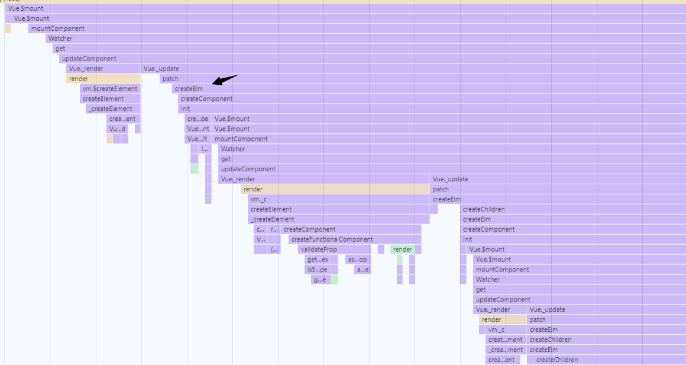
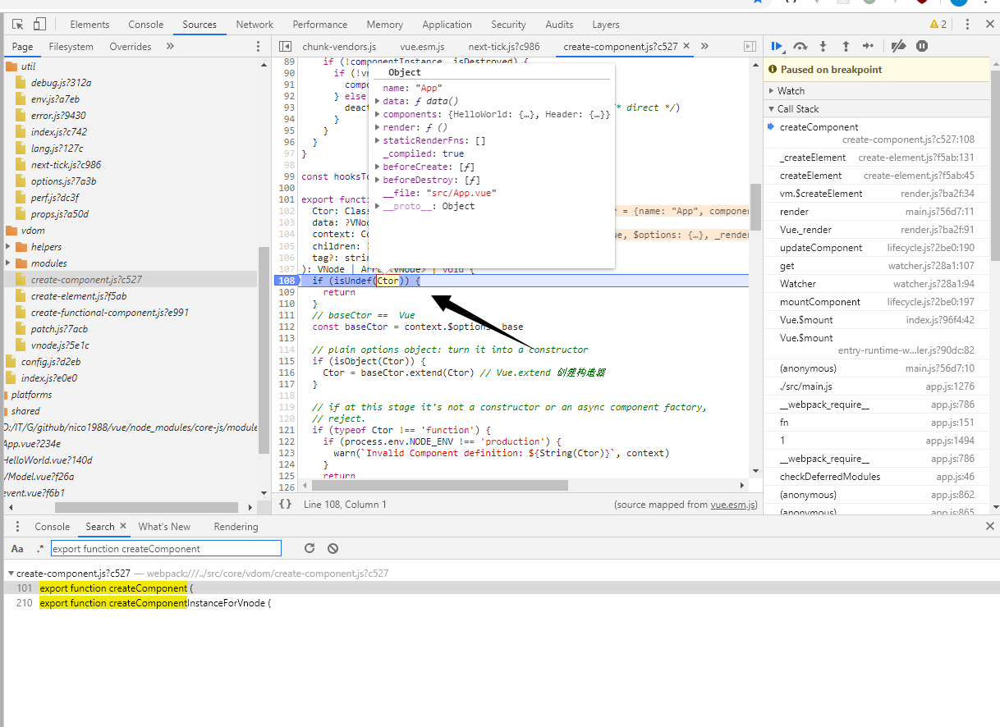
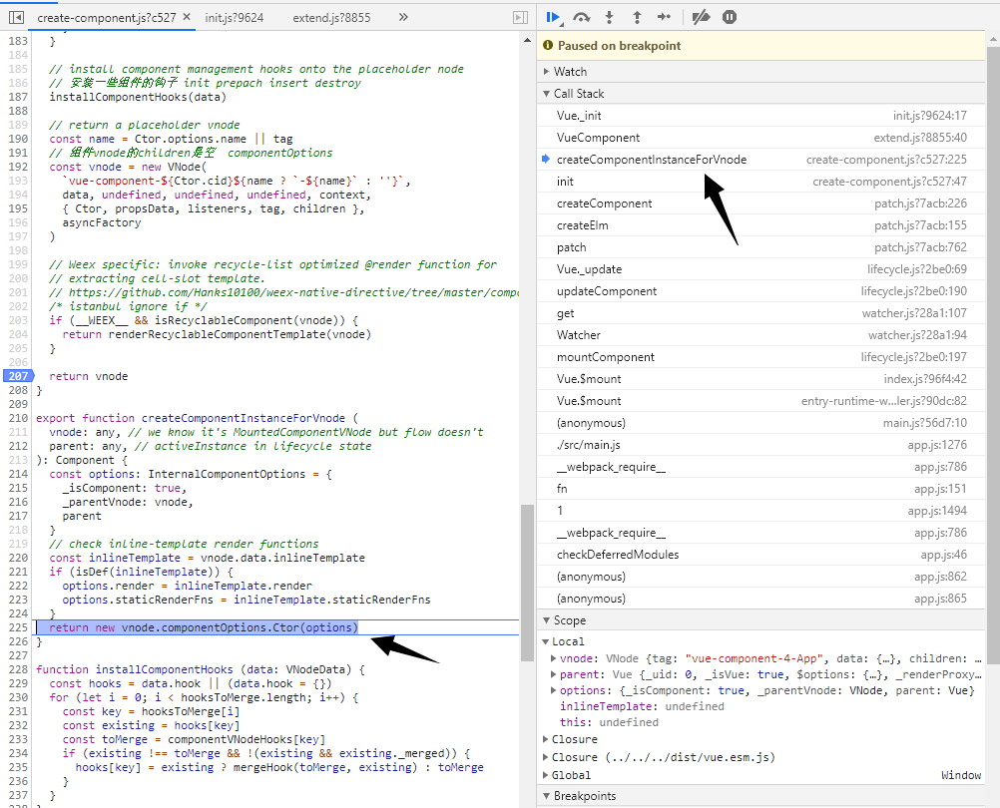

### createComponent

Vue.js 另一个核心思想是组件化。所谓组件化，就是把页面拆分成多个组件 (component)，每个组件依赖的 CSS、JavaScript、模板、图片等资源放在一起开发和维护。组件是资源独立的，组件在系统内部可复用，组件和组件之间可以嵌套。

我们在用 Vue.js 开发实际项目的时候，就是像搭积木一样，编写一堆组件拼装生成页面。在 Vue.js 的官网中，也是花了大篇幅来介绍什么是组件，如何编写组件以及组件拥有的属性和特性。

下面分析一下组件生成的步骤

首先，还是看一个我们项目的工程入口文件

```
import Vue from '../../../../dist/vue.esm'  // runtim-compiler
// import Vue from '../../../../dist/vue.runtime.esm'  // runtim-only
import router from './router'
import App from './App.vue'

Vue.config.productionTip = false

var app = new Vue({
  render: h => h(App),
  router
}).$mount('#app') // 显示调用$mount 如果不显示调用 要在option中指定el
```

可以看出，在new Vue的时候，通过手动指定的方式，options中的render传递的就是一个函数，返回的是一个函数调用，参数是App,这个参数就是createElement，why?

大致逻辑

- new Vue --> Vue.prototype.init -- Vue.$mount -- mountComponent -- Watcher.get -- updateComponent - Vue.render也就是下面的代码
- 然后通过解构赋值拿到当前实例(第一次渲染)的 render `const { render, _parentVnode } = vm.$options`
- `vnode = render.call(vm._renderProxy, vm.$createElement)`,这里通过指定执行上下文为vm._renderProxy,传入的参数就是vm.$createElement

[core/instance/render.js](<https://github.com/nico1988/vue-analyse/blob/e4fd2b76179f3892b36f3f0d5764ff3f7d773b0a/src/core/instance/render.js#L79>)

```
  Vue.prototype._render = function (): VNode {
    const vm: Component = this
    const { render, _parentVnode } = vm.$options

    if (_parentVnode) {
      vm.$scopedSlots = normalizeScopedSlots(
        _parentVnode.data.scopedSlots,
        vm.$slots,
        vm.$scopedSlots
      )
    }

    // set parent vnode. this allows render functions to have access
    // to the data on the placeholder node.
    vm.$vnode = _parentVnode // 占位符 父vnode
    // render self
    let vnode
    try {
      // There's no need to maintain a stack because all render fns are called
      // separately from one another. Nested component's render fns are called
      // when parent component is patched.
      currentRenderingInstance = vm
      vnode = render.call(vm._renderProxy, vm.$createElement) // vm._renderProxy（inint.js:49/53）开发环境是proxy对象  生产环境就是vm本身
    } catch (e) {
      handleError(e, vm, `render`)
      // return error render result,
      // or previous vnode to prevent render error causing blank component
      /* istanbul ignore else */
      if (process.env.NODE_ENV !== 'production' && vm.$options.renderError) {
        try {
          vnode = vm.$options.renderError.call(vm._renderProxy, vm.$createElement, e)
        } catch (e) {
          handleError(e, vm, `renderError`)
          vnode = vm._vnode
        }
      } else {
        vnode = vm._vnode
      }
    } finally {
      currentRenderingInstance = null
    }
    // if the returned array contains only a single node, allow it
    if (Array.isArray(vnode) && vnode.length === 1) {
      vnode = vnode[0]
    }
    // return empty vnode in case the render function errored out
    if (!(vnode instanceof VNode)) {
      // 如果有多个根节点 根节点只有一个vnode
      if (process.env.NODE_ENV !== 'production' && Array.isArray(vnode)) {
        warn(
          'Multiple root nodes returned from render function. Render function ' +
          'should return a single root node.',
          vm
        )
      }
      vnode = createEmptyVNode()
    }
    // set parent
    vnode.parent = _parentVnode  // 渲染vnode
    return vnode // vnode就是virtual dom的概念
  }

```
- vm.$createElement的函数定义也在render.js中 `vm.$createElement = (a, b, c, d) => createElement(vm, a, b, c, d, true)`

- 其实，不管是手写render还是Vue生成的render函数，_createElement最终都是调用createComponent创建了一个vnode

#### createElement

[src/core/vdom/create-element.js](<https://github.com/nico1988/vue-analyse/blob/e4fd2b76179f3892b36f3f0d5764ff3f7d773b0a/src/core/vdom/create-element.js#L120>)

在createElement的过程中，会判断当前的tag是普通html标签，会创建一个vnode；

否则会走else逻辑，通过createComponent方法创建一个vnode

```javascript
if (typeof tag === 'string') {
  let Ctor
  ns = (context.$vnode && context.$vnode.ns) || config.getTagNamespace(tag)
  if (config.isReservedTag(tag)) {
    // platform built-in elements
    vnode = new VNode(
      config.parsePlatformTagName(tag), data, children,
      undefined, undefined, context
    )
  } else if (isDef(Ctor = resolveAsset(context.$options, 'components', tag))) {
    // component
    vnode = createComponent(Ctor, data, context, children, tag)
  } else {
    // unknown or unlisted namespaced elements
    // check at runtime because it may get assigned a namespace when its
    // parent normalizes children
    vnode = new VNode(
      tag, data, children,
      undefined, undefined, context
    )
  }
} else {
  // direct component options / constructor
  vnode = createComponent(tag, data, context, children)
}
```

[core\vdom\create-element.js](<https://github.com/nico1988/vue-analyse/blob/e4fd2b76179f3892b36f3f0d5764ff3f7d773b0a/src/core/vdom/create-element.js>)

```
export function _createElement (
  context: Component,
  tag?: string | Class<Component> | Function | Object,
  data?: VNodeData,
  children?: any,
  normalizationType?: number
): VNode | Array<VNode> {
  if (isDef(data) && isDef((data: any).__ob__)) { // 不允许vnodedata是响应式的
    process.env.NODE_ENV !== 'production' && warn(
      `Avoid using observed data object as vnode data: ${JSON.stringify(data)}\n` +
      'Always create fresh vnode data objects in each render!',
      context
    )
    return createEmptyVNode() // 创建一个空的vnode 理解为注释vnode
  }
  // object syntax in v-bind
  if (isDef(data) && isDef(data.is)) {
    tag = data.is
  }
  if (!tag) {
    // in case of component :is set to falsy value
    return createEmptyVNode() // 创建一个空的vnode 理解为注释vnode
  }
  // warn against non-primitive key
  if (process.env.NODE_ENV !== 'production' &&
    isDef(data) && isDef(data.key) && !isPrimitive(data.key)
  ) {
    if (!__WEEX__ || !('@binding' in data.key)) {
      warn(
        'Avoid using non-primitive value as key, ' +
        'use string/number value instead.',
        context
      )
    }
  }
  // support single function children as default scoped slot
  if (Array.isArray(children) &&
    typeof children[0] === 'function'
  ) {
    data = data || {}
    data.scopedSlots = { default: children[0] }
    children.length = 0
  }
  // !!! 比较重要  对children做normalize why？ 处理成一维数组 方便后期处理
  if (normalizationType === ALWAYS_NORMALIZE) {
    children = normalizeChildren(children)
  } else if (normalizationType === SIMPLE_NORMALIZE) {
    children = simpleNormalizeChildren(children)
  }
  let vnode, ns
  if (typeof tag === 'string') {
    let Ctor
    ns = (context.$vnode && context.$vnode.ns) || config.getTagNamespace(tag)
    /**
     * tag 判断  string  原生标签  组件 其他
     */
    if (config.isReservedTag(tag)) { // 是否是html保留标签
      // platform built-in elements
      if (process.env.NODE_ENV !== 'production' && isDef(data) && isDef(data.nativeOn)) {
        warn(
          `The .native modifier for v-on is only valid on components but it was used on <${tag}>.`,
          context
        )
      }
      vnode = new VNode(
        config.parsePlatformTagName(tag), data, children,
        undefined, undefined, context
      )
    } else if ((!data || !data.pre) && isDef(Ctor = resolveAsset(context.$options, 'components', tag))) {
      // component
      // 传递的是组件对象
      vnode = createComponent(Ctor, data, context, children, tag)
    } else {
      // unknown or unlisted namespaced elements  其他不认识的
      // check at runtime because it may get assigned a namespace when its
      // parent normalizes children
      vnode = new VNode(
        tag, data, children,
        undefined, undefined, context
      )
    }
  } else {
    // direct component options / constructor
    vnode = createComponent(tag, data, context, children)
  }
  if (Array.isArray(vnode)) {
    return vnode
  } else if (isDef(vnode)) { // v !== undefined && v !== null
    if (isDef(ns)) applyNS(vnode, ns)
    if (isDef(data)) registerDeepBindings(data)
    return vnode
  } else {
    return createEmptyVNode()
  }
}

```

- 终于进入正题了，请看下面的调用栈关系

##### 两个维度查看调用栈




##### createComponent入栈




查看Ctor，第一次其实就是我们在main.js中引入的App

- 这里的Ctor之所以会多出来这么多，是因为经过vue-loader处理以后的

- render函数就是通过模板转化而来的

[src/core/vdom/create-component.js](<https://github.com/nico1988/vue-analyse/blob/dcbc8750cea8c6c92b46082eb1cd5145b748e9e4/src/core/vdom/create-component.js#L101>)

```JavaScript
export function createComponent (
  Ctor: Class<Component> | Function | Object | void,
  data: ?VNodeData,
  context: Component,
  children: ?Array<VNode>,
  tag?: string
): VNode | Array<VNode> | void {
  if (isUndef(Ctor)) {
    return
  }
  // baseCtor ==  Vue
  const baseCtor = context.$options._base // base 就是 Vue _base在global-api $option在instance/init.js中通过mergeoptions获取base

  // plain options object: turn it into a constructor
  if (isObject(Ctor)) {
    Ctor = baseCtor.extend(Ctor) // global-api/extend.js Vue.extend 创建构造器
  }

  // if at this stage it's not a constructor or an async component factory,
  // reject.
  if (typeof Ctor !== 'function') {
    if (process.env.NODE_ENV !== 'production') {
      warn(`Invalid Component definition: ${String(Ctor)}`, context)
    }
    return
  }

  // async component 异步组件
  let asyncFactory
  if (isUndef(Ctor.cid)) {
    asyncFactory = Ctor
    Ctor = resolveAsyncComponent(asyncFactory, baseCtor)
    if (Ctor === undefined) {
      // return a placeholder node for async component, which is rendered
      // as a comment node but preserves all the raw information for the node.
      // the information will be used for async server-rendering and hydration.
      return createAsyncPlaceholder(
        asyncFactory,
        data,
        context,
        children,
        tag
      )
    }
  }

  data = data || {} // data处理

  // resolve constructor options in case global mixins are applied after
  // component constructor creation
  resolveConstructorOptions(Ctor)

  // transform component v-model data into props & events
  if (isDef(data.model)) {
    transformModel(Ctor.options, data)
  }

  // extract props
  const propsData = extractPropsFromVNodeData(data, Ctor, tag)

  // functional component
  if (isTrue(Ctor.options.functional)) {
    return createFunctionalComponent(Ctor, propsData, data, context, children)
  }

  // extract listeners, since these needs to be treated as
  // child component listeners instead of DOM listeners
  const listeners = data.on
  // replace with listeners with .native modifier
  // so it gets processed during parent component patch.
  data.on = data.nativeOn

  if (isTrue(Ctor.options.abstract)) {
    // abstract components do not keep anything
    // other than props & listeners & slot

    // work around flow
    const slot = data.slot
    data = {}
    if (slot) {
      data.slot = slot
    }
  }

  // install component management hooks onto the placeholder node
  // 安装一些组件的钩子 init prepach insert destroy
  installComponentHooks(data)

  // return a placeholder vnode
  const name = Ctor.options.name || tag
  // 组件vnode的children是空 第三个参数是空的 componentOptions
  const vnode = new VNode(
    `vue-component-${Ctor.cid}${name ? `-${name}` : ''}`,
    data, undefined, undefined, undefined, context,
    { Ctor, propsData, listeners, tag, children },
    asyncFactory
  )

  // Weex specific: invoke recycle-list optimized @render function for
  // extracting cell-slot template.
  // https://github.com/Hanks10100/weex-native-directive/tree/master/component
  /* istanbul ignore if */
  if (__WEEX__ && isRecyclableComponent(vnode)) {
    return renderRecyclableComponentTemplate(vnode)
  }

  return vnode
}
```

这里逻辑比较复杂，主要做了三个步骤

- 构建子组件构造函数

```javascript
// baseCtor ==  Vue
const baseCtor = context.$options._base // base 就是 Vue _base在global-api $option在instance/init.js中通过mergeoptions获取base

// plain options object: turn it into a constructor
if (isObject(Ctor)) {
    Ctor = baseCtor.extend(Ctor) // global-api/extend.js Vue.extend 创建构造器
}
```

其中

_base  global-api中定义

```
Vue.options._base = Vue
```

$option在instance/init.js中通过mergeoptions获取base

```
vm.$options = mergeOptions(
  resolveConstructorOptions(vm.constructor),
  options || {},
  vm
)
```

这里的baseCtor.extend其实就是Vue.extend

```js
/**
 * Class inheritance
 */
Vue.extend = function (extendOptions: Object): Function {
  extendOptions = extendOptions || {}
  const Super = this
  const SuperId = Super.cid
  const cachedCtors = extendOptions._Ctor || (extendOptions._Ctor = {})
  if (cachedCtors[SuperId]) {
    return cachedCtors[SuperId]
  }

  const name = extendOptions.name || Super.options.name
  if (process.env.NODE_ENV !== 'production' && name) {
    validateComponentName(name)
  }

  const Sub = function VueComponent (options) {
    this._init(options)
  }
  Sub.prototype = Object.create(Super.prototype)
  Sub.prototype.constructor = Sub
  Sub.cid = cid++
  Sub.options = mergeOptions(
    Super.options,
    extendOptions
  )
  Sub['super'] = Super

  // For props and computed properties, we define the proxy getters on
  // the Vue instances at extension time, on the extended prototype. This
  // avoids Object.defineProperty calls for each instance created.
  if (Sub.options.props) {
    initProps(Sub)
  }
  if (Sub.options.computed) {
    initComputed(Sub)
  }

  // allow further extension/mixin/plugin usage
  Sub.extend = Super.extend
  Sub.mixin = Super.mixin
  Sub.use = Super.use

  // create asset registers, so extended classes
  // can have their private assets too.
  ASSET_TYPES.forEach(function (type) {
    Sub[type] = Super[type]
  })
  // enable recursive self-lookup
  if (name) {
    Sub.options.components[name] = Sub
  }

  // keep a reference to the super options at extension time.
  // later at instantiation we can check if Super's options have
  // been updated.
  Sub.superOptions = Super.options
  Sub.extendOptions = extendOptions
  Sub.sealedOptions = extend({}, Sub.options)

  // cache constructor
  cachedCtors[SuperId] = Sub
  return Sub
}
```

这样就返回了一个Sub的构造函数，`Vue.extend` 的作用就是构造一个 `Vue` 的子类，它使用一种非常经典的原型继承的方式把一个纯对象转换一个继承于 `Vue` 的构造器 `Sub` 并返回，然后对 `Sub` 这个对象本身扩展了一些属性，如扩展 `options`、添加全局 API 等；并且对配置中的 `props` 和 `computed` 做了初始化工作；最后对于这个 `Sub` 构造函数做了缓存，避免多次执行 `Vue.extend` 的时候对同一个子组件重复构造。

在上面的代码中有一个逻辑，只要实例化sub的时候，就会走init逻辑，其实即使Vue的init方法

```
const Sub = function VueComponent (options) {
  this._init(options)
}
```

这里由于涉及到patch更新的调用逻辑，简单看一下实例化子组件的时候调用sub




- 安装组件钩子函数

```
// install component management hooks onto the placeholder node
installComponentHooks(data)
```

 Vue.js 使用的 Virtual DOM 参考的是开源库 [snabbdom](https://github.com/snabbdom/snabbdom)，它的一个特点是在 VNode 的 patch 流程中对外暴露了各种时机的钩子函数，方便我们做一些额外的事情，Vue.js 也是充分利用这一点，在初始化一个 Component 类型的 VNode 的过程中实现了几个钩子函数：

```javascript
const componentVNodeHooks = {
  init (vnode: VNodeWithData, hydrating: boolean): ?boolean {
    if (
      vnode.componentInstance &&
      !vnode.componentInstance._isDestroyed &&
      vnode.data.keepAlive
    ) {
      // kept-alive components, treat as a patch
      const mountedNode: any = vnode // work around flow
      componentVNodeHooks.prepatch(mountedNode, mountedNode)
    } else {
      const child = vnode.componentInstance = createComponentInstanceForVnode(
        vnode,
        activeInstance
      )
      child.$mount(hydrating ? vnode.elm : undefined, hydrating)
    }
  },

  prepatch (oldVnode: MountedComponentVNode, vnode: MountedComponentVNode) {
    const options = vnode.componentOptions
    const child = vnode.componentInstance = oldVnode.componentInstance
    updateChildComponent(
      child,
      options.propsData, // updated props
      options.listeners, // updated listeners
      vnode, // new parent vnode
      options.children // new children
    )
  },

  insert (vnode: MountedComponentVNode) {
    const { context, componentInstance } = vnode
    if (!componentInstance._isMounted) {
      componentInstance._isMounted = true
      callHook(componentInstance, 'mounted')
    }
    if (vnode.data.keepAlive) {
      if (context._isMounted) {
        // vue-router#1212
        // During updates, a kept-alive component's child components may
        // change, so directly walking the tree here may call activated hooks
        // on incorrect children. Instead we push them into a queue which will
        // be processed after the whole patch process ended.
        queueActivatedComponent(componentInstance)
      } else {
        activateChildComponent(componentInstance, true /* direct */)
      }
    }
  },

  destroy (vnode: MountedComponentVNode) {
    const { componentInstance } = vnode
    if (!componentInstance._isDestroyed) {
      if (!vnode.data.keepAlive) {
        componentInstance.$destroy()
      } else {
        deactivateChildComponent(componentInstance, true /* direct */)
      }
    }
  }
}
const hooksToMerge = Object.keys(componentVNodeHooks)
// ……
function installComponentHooks (data: VNodeData) {
  // 把componentVNodeHooks merge 到data.hooks上
  const hooks = data.hook || (data.hook = {})
  for (let i = 0; i < hooksToMerge.length; i++) {
    const key = hooksToMerge[i]
    const existing = hooks[key]
    const toMerge = componentVNodeHooks[key]
    if (existing !== toMerge && !(existing && existing._merged)) {
      hooks[key] = existing ? mergeHook(toMerge, existing) : toMerge
    }
  }
}

```


- 实例化vnode

```
const name = Ctor.options.name || tag
const vnode = new VNode(
  `vue-component-${Ctor.cid}${name ? `-${name}` : ''}`,
  data, undefined, undefined, undefined, context,
  { Ctor, propsData, listeners, tag, children },
  asyncFactory
)
return vnode
```

