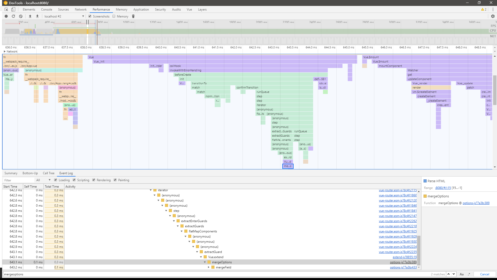
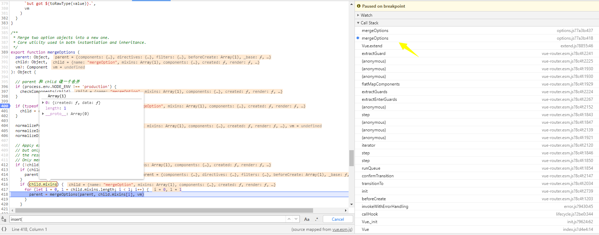

关于mergeOption的调用时机

通过查看函数的调用栈，我们发现mergeOption发生在几个时机

- 初始化项目调用Vue.prototype.init时 (分为初始化Vue的init和调用自组件Sub的init)

- 调用全局Vue.mixin的时候

- 调用Vue.extend的构造自组件构造器执行了Sub.options = mergeOptions

  一图解千言




#### mergeOptions的实现

主要处理了几个逻辑

- 递归调用mergeField合并options、
- 最终返回一个options

core\util\options.js

```javascript
export function mergeOptions (
  parent: Object,
  child: Object,
  vm?: Component
): Object {

  // parent 和 child 做一个合并
  if (process.env.NODE_ENV !== 'production') {
    checkComponents(child)
  }

  if (typeof child === 'function') {
    child = child.options
  }

  normalizeProps(child, vm)
  normalizeInject(child, vm)
  normalizeDirectives(child)

  // Apply extends and mixins on the child options,
  // but only if it is a raw options object that isn't
  // the result of another mergeOptions call.
  // Only merged options has the _base property.
  if (!child._base) {
    if (child.extends) {
      parent = mergeOptions(parent, child.extends, vm)
    }
    if (child.mixins) {
      for (let i = 0, l = child.mixins.length; i < l; i++) {
        parent = mergeOptions(parent, child.mixins[i], vm)
      }
    }
  }

  const options = {}
  let key
  for (key in parent) {
    mergeField(key)
  }
  for (key in child) {
    if (!hasOwn(parent, key)) {
      mergeField(key)
    }
  }
  function mergeField (key) {
    const strat = strats[key] || defaultStrat // 不同类型的合并策略
    options[key] = strat(parent[key], child[key], vm, key)
  }
  return options
}
```


- 执行Vue.mixin  

Vue.options在global-api/index.js中已近进行了初始化

```javascript
import { mergeOptions } from '../util/index'

export function initMixin (Vue: GlobalAPI) {
  Vue.mixin = function (mixin: Object) {
    this.options = mergeOptions(this.options, mixin)
    return this
  }
}
```

- demo

```javascript
<template>
    <div>
        parent:: 这里是parent的内容
        <child-comp></child-comp>
    </div>
</template>
<script>
import Vue from 'vue'
let childComp = {
    template: '<div>child:: {{msg}}</div>',
    created() {
        console.log('child created:: ')
    },
    mounted() {
        console.log('child mounted:: ')
    },
    data() {
        return {
            msg: 'this is child component'
        }
    }
}

var mixin = {
    created() {
        console.log("parent created:: ")
    },
    data: function () {
        return {
            message: 'hello',
            foo: 'abc'
        }
    }
}
export default {
    name: 'mergeOption',
    created() {
        console.log("parent created:: ")
    },
    mixins: [mixin],
    components: {
        childComp
    }
}
</script>

```


- 自组件中如果有mixin



- 组件的合并配置 

  initInternalComponent,合并完的结果保留在 `vm.$options` 中

```
if (options && options._isComponent) { // 如果是组件进来走这里
      // optimize internal component instantiation
      // since dynamic options merging is pretty slow, and none of the
      // internal component options needs special treatment.
      initInternalComponent(vm, options)
    } else {
      console.log("Vue.init:: 第一次通过new Vue 执行这里 _init 被调用")
      vm.$options = mergeOptions( // 合并options
        resolveConstructorOptions(vm.constructor), // 如果是第一次其实就是Vue的options
        options || {},
        vm
      )
      console.log("vm.$options: %o",vm.$options)
    }
```


### 总结

- 外部调用的合并配置通过mergeOptions，并有多种合并策略
- 组件合并通过initInternalComponent，合并更快，应为就是变量赋值
- vue定义了很多自定义配置，同时在初始化的时候传入了配置，然后进行merge配置，来达到不同定制化不同需求的目的。