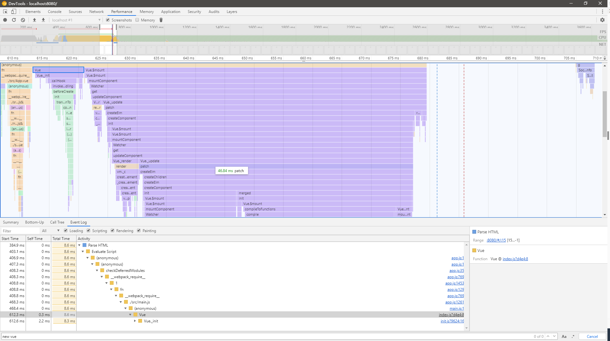

从一个简单的使用场景入口
```
// import Vue from 'vue'
import Vue from '../../../../dist/vue.esm'  // runtim-compiler
// import Vue from '../../../../dist/vue.runtime.esm'  // runtim-only
import router from './router'
import App from './App.vue'

Vue.config.productionTip = false

new Vue({
  render: h => h(App),
  data: {
    message: 'Hello Vue!'
  },
  router
}).$mount('#app')
```
我们可以看到Vue其实就是一个构造函数，参数是一个对象，具体发生了什么，需要深入到源码里边去瞧一瞧,在[src/core/instance/index.js](https://github.com/nico1988/vue-analyse/blob/b5b1ac373a8f4d464454e7770a888fdd178891c4/src/core/instance/index.js#L8)中

关于Vue的定义
```javascript
function Vue (options) {
  if (process.env.NODE_ENV !== 'production' &&
    !(this instanceof Vue)
  ) {
    warn('Vue is a constructor and should be called with the `new` keyword')
  }
  this._init(options)
}

initMixin(Vue)
stateMixin(Vue)
eventsMixin(Vue)
lifecycleMixin(Vue)
renderMixin(Vue)

export default Vue
```

分析这个文件，在外部导入Vue的时候会执行一些初始化方法，主要是做了一些mixin，state，data，lifecycle钩子，render函数的初始化。

在调用new Vue的时候，主要执行了`this._init(options)`这个方法，这个方法定义在[src/core/instance/init.js](https://github.com/nico1988/vue-analyse/blob/b293aa46d1360bb3a2bf1444aba6153566be247b/src/core/instance/init.js#L16)这个js中

```
Vue.prototype._init = function (options?: Object) {
    const vm: Component = this
    // a uid
    vm._uid = uid++

    let startTag, endTag
    /* istanbul ignore if */
    if (process.env.NODE_ENV !== 'production' && config.performance && mark) {
      startTag = `vue-perf-start:${vm._uid}`
      endTag = `vue-perf-end:${vm._uid}`
      mark(startTag)
    }

    // a flag to avoid this being observed
    vm._isVue = true
    // merge options

    if (options && options._isComponent) {
      // optimize internal component instantiation
      // since dynamic options merging is pretty slow, and none of the
      // internal component options needs special treatment.
      initInternalComponent(vm, options)
    } else {
      console.log("_init 被调用")
      console.log("vm.$options = mergeOptions")
      vm.$options = mergeOptions(
        resolveConstructorOptions(vm.constructor),
        options || {},
        vm
      )
      console.log("vm.$options: %o",vm.$options)
    }
    /* istanbul ignore else */
    if (process.env.NODE_ENV !== 'production') {
      // 调用proxy render函数用到
      initProxy(vm)
    } else {
      vm._renderProxy = vm
    }
    // expose real self
    vm._self = vm
    // 初始化
    initLifecycle(vm)
    initEvents(vm)
    initRender(vm)
    // 执行beforeCreate钩子函数
    callHook(vm, 'beforeCreate')
    initInjections(vm) // resolve injections before data/props
    initState(vm) // 初始化state
    initProvide(vm) // resolve provide after data/props
    // 执行created钩子函数
    callHook(vm, 'created')

    /* istanbul ignore if */
    if (process.env.NODE_ENV !== 'production' && config.performance && mark) {
      vm._name = formatComponentName(vm, false)
      mark(endTag)
      measure(`vue ${vm._name} init`, startTag, endTag)
    }

    if (vm.$options.el) { // $mount
      vm.$mount(vm.$options.el)
    }
  }
```

我们看到__init方法挂在在Vue的原型上，那么通过this.__init就可以访问到，其中的this就是Vue

大体来说，vue的初始化干了几个事情，合并配置，初始化生命周期，初始化事件中心，初始化渲染，初始化data、props、computed、watcher等等

### 总结

new Vue的逻辑大体上来说非常清晰，主线过程一目了然，后面我们会看看$mount发生了什么

配上new Vue的[火焰图](new-Vue发生了什么Profile-20191221T163226.json)(new Vue和$mount就花了60ms)

