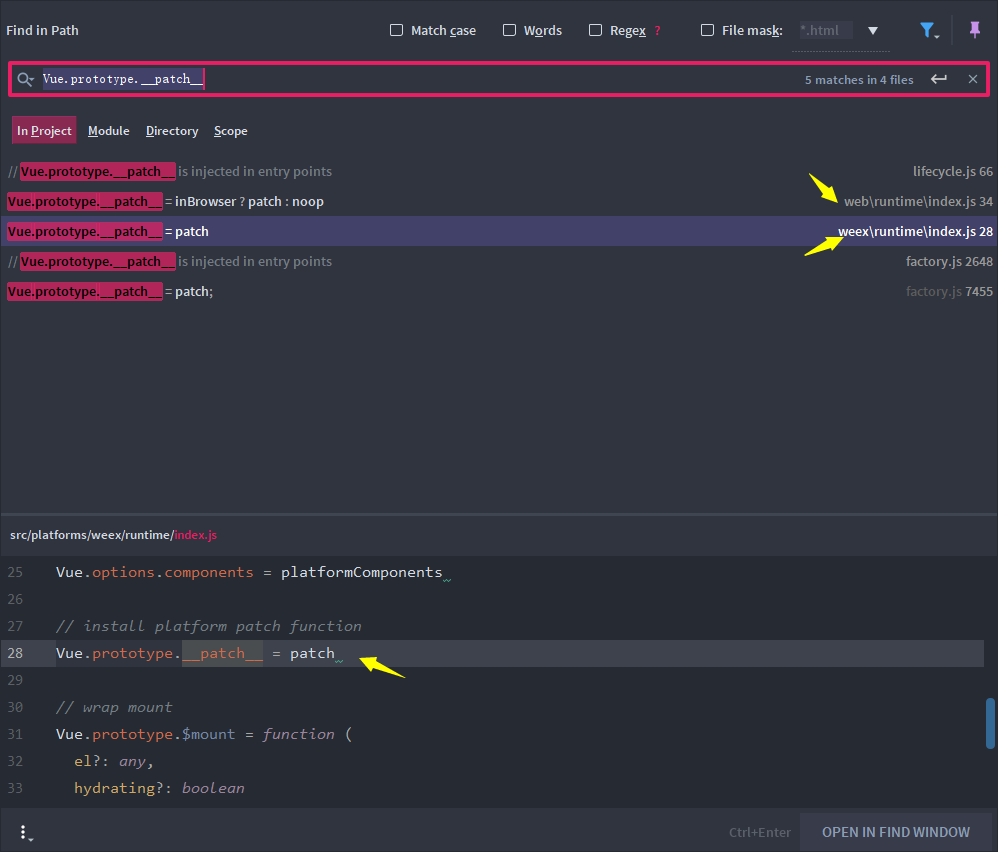
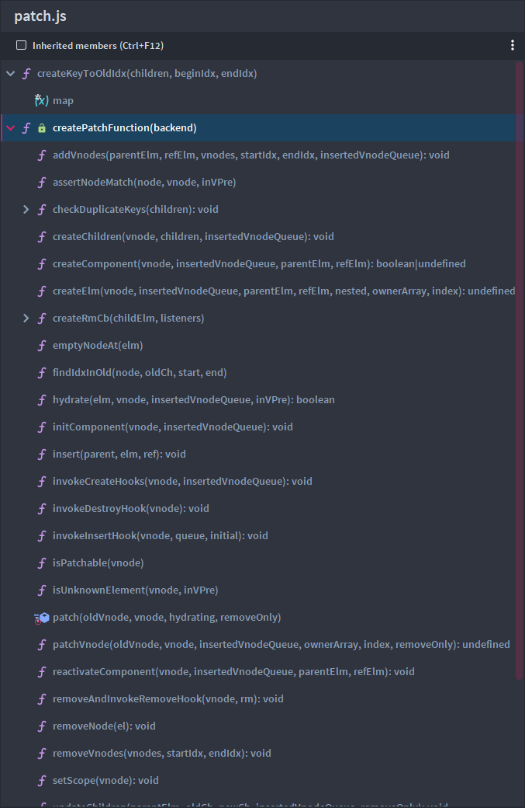

### 两个维度的调用栈


> javascript是单线程执行的，组件的创建其实就是一个深度遍历 同步执行的过程

上来先上图，首先我们知道patch利用了函数柯里化的思想，目前vue可以支持vue和weex的patch


从下图可以看出，整个组件创建，其实就是递归调用创建vnode的过程


patch

前面多次说过，Vue利用函数柯里化, 通过打包文件的入口配置（scripts\config.js），在rollup打包生成vue文件的时候，不同的平台分成不同的入口文件。

这样，我们通过在工程中导入不同平台的vue文件，引入的就是不同的patch方法，这样的好处是核心和实现分离，不用再核心代码中判断是否是不同的平台，否则就是一堆的if else判断，实在是精妙！！！



- web平台

src\platforms\web\runtime\patch.js

```
export const patch: Function = createPatchFunction({ nodeOps, modules })
```

src\core\vdom\patch.js: createPatchFunction

这里的createPatchFunction中返回了一个patch闭包




- weex平台