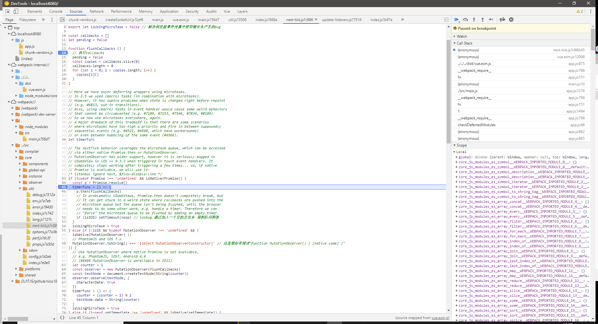

### vue源码解析

[vue仓库地址](https://github.com/nico1988/vue-analyse)(该fork官方的仓库，同时加上自己的注解)


vue源码调试步骤

- 安装nodejs，最好是10以上
- clong 仓库

```
git clone https://github.com/nico1988/vue-analyse
```

- npm install (或者通过cnpm、yarn等)
- npm run dev:esm 
  - 开启vue源码工程，源码的任何改变都会动态生成vue文件
  - 我已配置了sourcemap模式,直接用就行
-  cd examples\vue-debug\vue-debug && npm run serve
  - 开启调试demo项目
- 打开f12，搜索你要调试的src下面的文件，打断点
- enjoy

