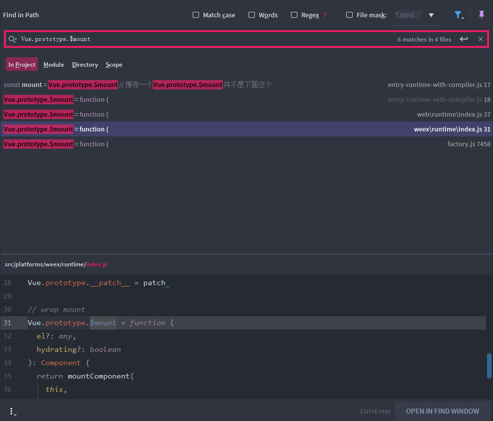

# 关于$mount


工程中在new Vue初始化的过程中，我们可以显示调用$mount或者通过传递options的el参数，手动绑定，这里的原理是怎么样的呢


### 项目工程入口文件

```javascript
import Vue from '../../../../dist/vue.esm'  // runtim-compiler
// import Vue from '../../../../dist/vue.runtime.esm'  // runtim-only
import router from './router'
import App from './App.vue'

Vue.config.productionTip = false

var app = new Vue({
  render: h => h(App),
  router
}).$mount('#app') // 显示调用$mount 如果不显示调用 要在option中指定el

```


### 关于函数柯里化


### 关于$mount的入口

我们在工程中import Vue的时候，通过指定引入不同平台vuejs文件，其实$mount其实也不一样




以web平台为例, 调用$mount其实就是调用了mountComponent，然后返回了一个Component类型

```javascript
// public mount method
Vue.prototype.$mount = function (
  el?: string | Element,
  hydrating?: boolean
): Component {
  el = el && inBrowser ? query(el) : undefined
  return mountComponent(this, el, hydrating)
}
```