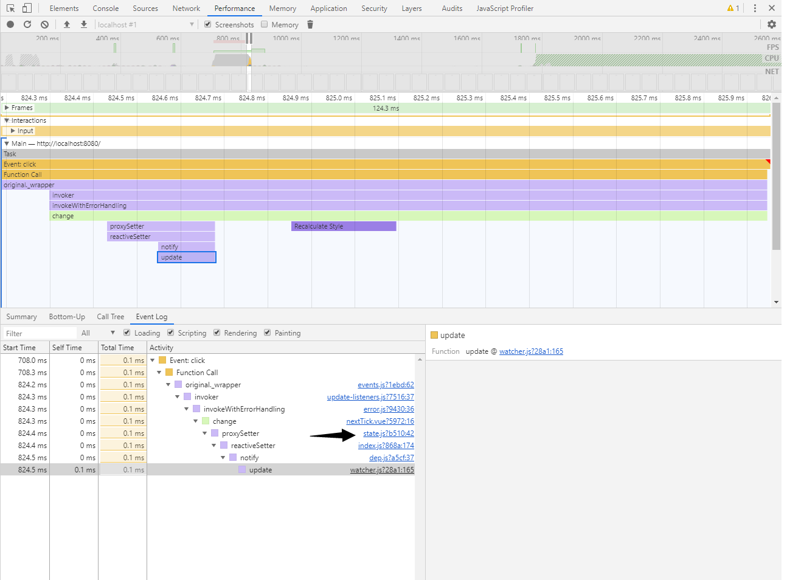

## vue的响应式原理主要利用了Object.defineProperty

通过设置对应的get set方法，达到动态监听属性值的变化，修改vue中data或者props的数据，会触发proxy的getset方法

proxy中的逻辑

代码位置:https://github.com/nico1988/vue-analyse/blob/xiams/src/core/instance/proxy.js>

```
export function proxy (target: Object, sourceKey: string, key: string) {
  sharedPropertyDefinition.get = function proxyGetter () {
    return this[sourceKey][key]
  }
  sharedPropertyDefinition.set = function proxySetter (val) {
    this[sourceKey][key] = val
  }
  Object.defineProperty(target, key, sharedPropertyDefinition)
}
```

测试，我们在代码中任何一个修改data中的值，这里我们简单修改data中msg，

```
<template>
  <div>
    <div ref="msg"> {{msg}} </div>
    <button @click="change">点击修改msg</button>
  </div>
</template>
<script>
export default {
    name: 'msg',
    data(){
        return {
            msg: 'hello-world'
        }
    },
    methods: {
        change() {
            this.msg = "msg";
        }
    }
}
</script>
```

打开performance，点击左上角记录调用堆栈，点击button修改msg的值，查看调用堆栈（可以直接下载我弄好的[json文件](../static/Profile-20191220T212217.json)，直接拖入|导入 到performance面板）

这里的proxySetter正是我们src/core/instance/proxy.js:proxy方法中定义的set函数，原理是通过Object.defineProperty，




### 参考

[vue analyse](<https://coding.imooc.com/class/228.html>)

[MDN defineProperty](<https://developer.mozilla.org/en-US/docs/Web/JavaScript/Reference/Global_Objects/Object/defineProperty>)